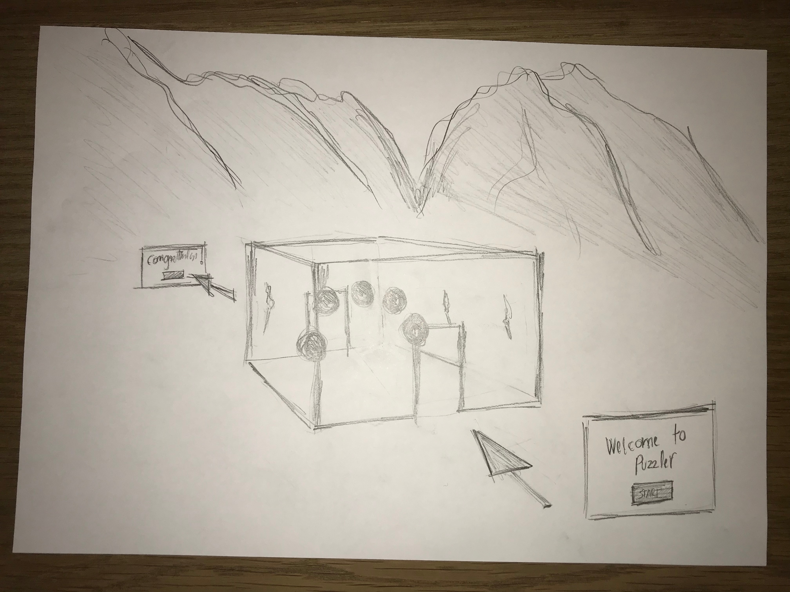
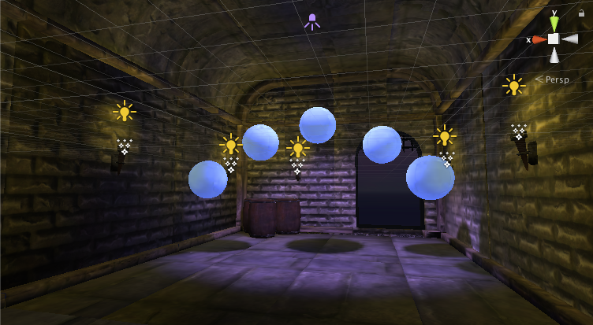
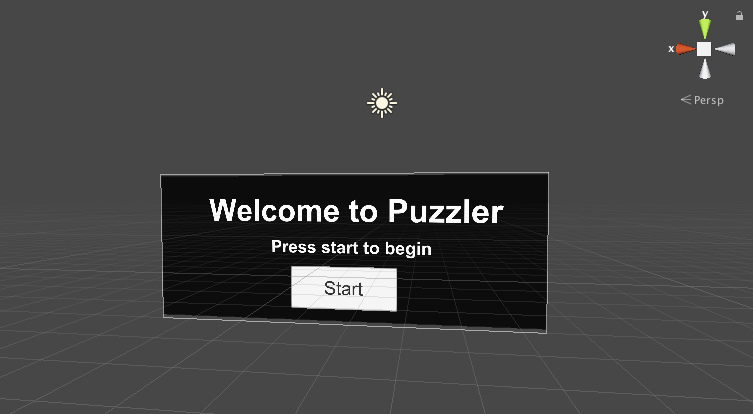

# Puzzler Starter Project

This project is part of [Udacity](https://www.udacity.com "Udacity - Be in demand")'s [VR Developer Nanodegree](https://www.udacity.com/course/vr-developer-nanodegree--nd017).

## Versions
- Unity 2017.1.0
- GVR Unity SDK v1.60.0
- iTween v2.0.7

# Write-up on Medium

https://medium.com/@miha_43105/my-puzzler-project-1fa507190251

# My Puzzler Project

As part of my coursework with Udacity, I created a mobile VR experience called
Puzzler. In this game player enters a gloomy dungeon with surreal-looking orbs
and is asked to solve a puzzle similar to a Simon says to move on.

Check out the [video](https://youtu.be/4H1svPWik-I).

## Sketches

Here are some conceptual sketches I created to lay down the design of the
project.

## Persona

I created a user persona called Michael. Michael is an 8-year-old gamer and has
minimal experience with VR. He likes playing games and he is fascinated by the
VR. He likes to solve the puzzles.

## User Testing

### User test 1

Where are my hands? How do I move around? 

It was interesting to see what is the first reaction to the 8-year-olds once
they experience a VR world. Their first intuition is to see their hands in the
VR world. Their next intuition is to move around by walking. Unfortunately,
their basic instincts can’t be satisfied with the mobile VR experience. I’m
sure it will be better once we move to the Oculus Rift :-)

### User test 2

Why do the torches don’t have a fire?

During the testing I've got complains that the torches don't have fire. I was
surprised how easy it is to [create the fire](https://www.youtube.com/watch?v=qShjsxopbfQ)
in Unity. I've created the particle
system, added the fire texture, adjusted some of the settings and the fire was
there. Awesome!

## Break down of the final piece

First I built the dungeon. I started with the front wall, built the middle
and then the back wall.

I added barrels and torches to make the dungeon look more interesting.

I’ve added the orbs and wired them up with the game script provided by the Udacity.
I’ve spent quite some on setting up the lights. I pointed purple spotlight
into the orbs and I used soft shadows. For the torches, I used dark orange
point lights. I made sure all the objects are static and then baked the light.
The scene in the dungeon looked a bit scary, which was cool.

Then I created the UI to start and restart the game. I used canvas, put it into the world coordinates and put
the text and buttons onto it.

I've put the dungeon into the mountains. Once I've added
the [fog](https://www.youtube.com/watch?v=TChSVtI4GEk) the scene looked
really cool. 

## Conclusion

The project was very interesting and I had great fun working on it. The best
thing of all was watching my kids playing the Puzzler and having fun in the
VR world.

## Next Steps

In the next project on the Udacity VR Nanodegree, we’ll have to build the
museum. For a change, we are not provided with a starter project which is a bit
scary but also very cool as we’ll have to build it from scratch.

## Link to additional work

https://github.com/miharothl/
